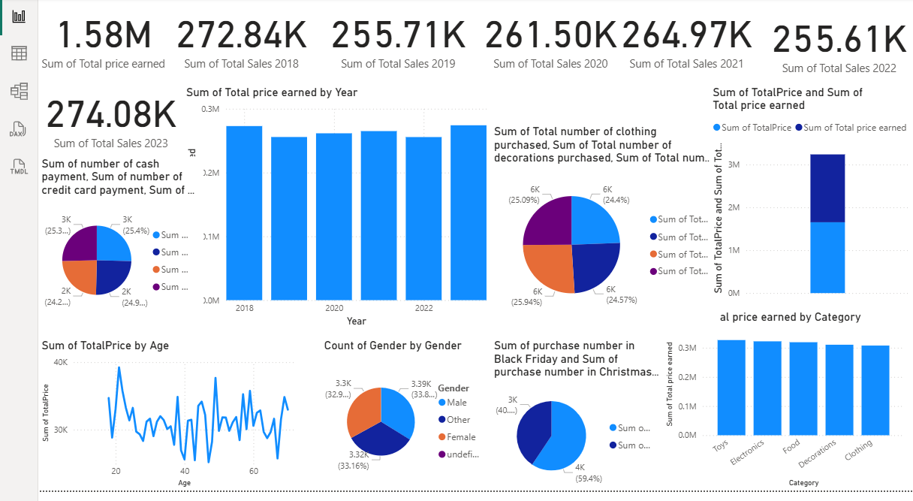

# 🎄 Christmas Sales and Trends Dashboard  

## 🔍 Project Overview  
This project analyzes **Christmas sales and trends** using the **Onyx Data – DataDNA Dataset Challenge (December 2023)**.  
It combines **Power BI dashboards** and **Python (Jupyter Notebook)** analysis to explore seasonal sales patterns and generate actionable insights.  

---

## 🛠 Tools & Technologies  
- **Power BI** – Interactive dashboard creation  
- **Python (Jupyter Notebook)** – Data exploration & cleaning  
- **Pandas & Matplotlib** – Data analysis & visualization  
- **CSV Dataset** – Onyx Data Challenge  

---

## 📂 Project Structure  
```

.
├── Data/
│   └── Onyx Data -DataDNA Dataset Challenge - Christmas Sales and Trends - December 2023.csv
├── Notebooks/
│   └── Cleaning.ipynb
├── Reports/
│   └── Christmas Sales and Trends Dashboard.pbix
├── Visuals/
│   └── Dashboard.png
└── README.md

````

---

## 📊 Dashboard Preview  

 

---

## 🔎 Key Insights  
- Seasonal spikes in **sales performance** around Christmas.  
- Breakdown of sales trends by **region, product, and time**.  
- Visual analysis to support **marketing and business decisions**.  

---

## 📂 Deliverables  
- 📊 **Power BI Report** → [Reports/Christmas Sales and Trends Dashboard.pbix](https://github.com/Nadine-Hossam/Christmas-Sales-Dashboard/blob/main/Reports/Christmas%20Sales%20and%20Trends%20Dashboard.pbix)  
- 🐍 **Python Notebook Analysis** → [Notebooks/Cleaning.ipynb](https://github.com/Nadine-Hossam/Christmas-Sales-Dashboard/blob/main/Notebooks/Cleaning.ipynb)  
- 📑 **Dataset** → [Data/Onyx Data -DataDNA Dataset Challenge - Christmas Sales and Trends - December 2023.csv](https://github.com/Nadine-Hossam/Christmas-Sales-Dashboard/blob/main/Data/Onyx%20Data%20-DataDNA%20Dataset%20Challenge%20-%20Christmas%20Sales%20and%20Trends%20-%20December%202023.csv)  
- 🖼 **Dashboard Image** → [Visuals/Dashboard.png](https://github.com/Nadine-Hossam/Christmas-Sales-Dashboard/blob/main/Visuals/Dashboard.png?raw=true)  
---
